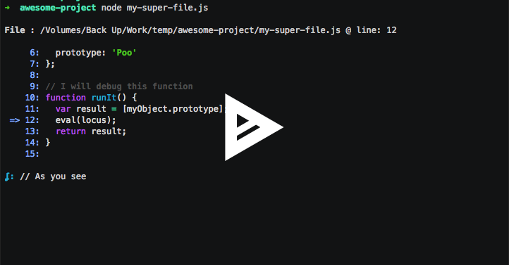

ʆ Locus
=======

Locus is a debugging module which allows you to execute commands at runtime via a REPL.

[](https://asciinema.org/a/102735?autoplay=1&speed=1.5)

## Installing

```bash
npm install locus --save-dev
```

## Using

```javascript
require('locus');

var myVar = 123;
var myObj = {
  key: 'value'
};

function makeSomething() {
  var some = 'some value';

  // will start a repl session
  // you can manipulate the program at runtime
  eval(locus);

  // another option
  eval(require('locus'))

  return some;
}

makeSomething();
```

Use **exit** command to leave.
